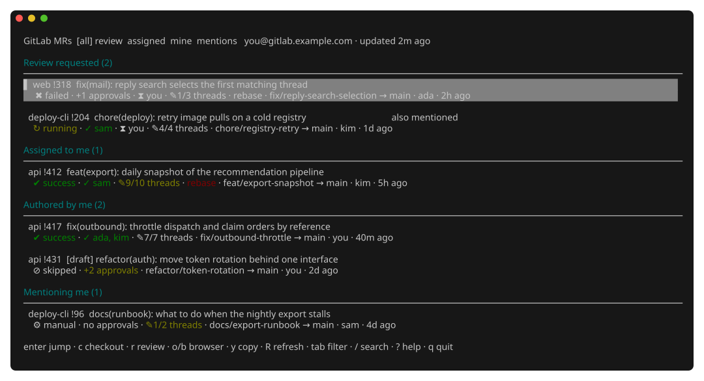

# herdr-glab

A [Herdr](https://herdr.dev) plugin for GitLab merge requests: a panel of every
MR that concerns you, one keystroke from an MR to a worktree or a review, and
each workspace's MR status in the sidebar.

All GitLab access goes through the [`glab`](https://gitlab.com/gitlab-org/cli)
CLI. The plugin never reads, stores or handles a token itself.

## What you get

**A panel** (an overlay, `?` shows its help) grouped by why the MR concerns
you — review requested, assigned, authored, mentioning you — with the pipeline,
who approved, which reviewers still owe one, resolved threads, and whether the
branch is checked out locally:



<sub>The screenshot runs the real panel over invented merge requests.</sub>

**Review threads in a drawer** — `t` splits the panel: the list narrows to one
line per merge request on the left, the selected one's discussion threads open
on the right, unresolved first. Expand a thread to read it in full, resolve or
reopen it, or hand it to the agent working on that branch.

**Actions on the selected MR**: fetch its source branch into a worktree
workspace, review it in [tuicr](https://tuicr.dev), jump to the workspace that
already has it checked out, open it in the browser, copy its link.

**Workspace status** in the Spaces sidebar as a `$mr` token, e.g. `!412 ✔ ✎9/10`,
for the branch each workspace has checked out — including merge requests that
are not yours.

**A count in the tab bar**, e.g. `MR 7 · 2 todo`, always visible.

**Ctrl+click** any MR URL in any pane to open that single merge request, even
one that has nothing to do with you.

## Requirements

- Herdr ≥ 0.9.0, macOS or Linux
- `glab`, logged in to your GitLab (`glab auth status`)
- `git`
- `tuicr` — optional, only for the review action

## Platforms

Releases ship binaries for macOS and Linux, on both amd64 and arm64:

| Platform | Status |
|---|---|
| macOS arm64 | developed and used on it daily |
| macOS amd64 | cross-compiled, never run |
| Linux amd64 | vet and tests run in CI, the plugin itself never run |
| Linux arm64 | cross-compiled, never run |
| Windows | not supported |

Reports from the untested platforms are welcome — open an issue.

Windows would need real work rather than another build target: the background
poller uses Unix process signals, `setsid` and `flock` to keep exactly one
instance alive, and the clipboard and browser actions shell out to Unix tools.
The manifest declares `platforms = ["macos", "linux"]` so Herdr does not offer
the plugin where it cannot run.

## Install

```bash
herdr plugin install hlouis/herdr-glab
```

The install step builds the plugin with your Go toolchain, or downloads the
release binary when you have no Go installed.

For local development:

```bash
git clone https://github.com/hlouis/herdr-glab
cd herdr-glab && make link
```

## Set it up

Nothing works until you say where things go, in `~/.config/herdr/config.toml`.
Run `herdr server reload-config` afterwards.

**A key for the panel.** Plugins cannot ship keybindings.

```toml
[[keys.command]]
key = "prefix+m"            # prefix+g is herdr's own goto
type = "plugin_action"
command = "hlouis.glab.panel"
description = "GitLab MR panel"

[[keys.command]]
key = "prefix+shift+m"
type = "plugin_action"
command = "hlouis.glab.refresh"
description = "refresh GitLab MR data"
```

**The sidebar token.** Herdr renders only the tokens you place in a row:

```toml
[ui.sidebar.spaces]
rows = [["state_icon", "workspace"], ["branch", "git_status"], ["$mr"]]
```

**The tab bar count.** `herdr plugin list` prints the plugin directory; use its
`bin/herdr-glab`:

```toml
[ui]
tab_bar_right = [
  { type = "command", command = "<plugin dir>/bin/herdr-glab status", interval_seconds = 30, timeout_seconds = 2 },
]
```

Ctrl+click needs no configuration.

## Keys in the panel

| Key | Action |
|---|---|
| `j` / `k` | move |
| `enter` | jump to the workspace that has this MR checked out |
| `c` | fetch the source branch and open it as a worktree workspace |
| `t` | open the review threads of this MR beside the list |
| `r` | review in tuicr, in a new tab of the repository's workspace |
| `o` / `b` | open in the default browser |
| `y` | copy the MR link |
| `tab` | filter: all / review / assigned / mine / mentions |
| `/` | search title, project and branch |
| `R` | fetch from GitLab now |
| `?` | help, including what every symbol means |
| `q` / `esc` | close |

## Configuration

Optional, in `$(herdr plugin config-dir hlouis.glab)/config.toml`:

```toml
host = "gitlab.example.com"  # default: the host glab is logged in to
fetch_interval = "5m"         # minimum 1m
glab_path = ""                # default: found on PATH
tuicr_path = ""
token_name = "mr"             # rename if another plugin already uses $mr
```

`host` matters when `glab` has several accounts: the plugin then follows glab's
own default host, and this setting overrides it.

## How it works

A background poller asks GitLab for your merge requests every `fetch_interval`
and writes them to a cache under `$HERDR_PLUGIN_STATE_DIR`. The panel, the
sidebar tokens and the tab bar count all read that cache, so they are instant
and work offline until the data goes stale. Workspace events recompute one
workspace's token from the cache without touching the network.

The poller starts with the Herdr server, and any plugin event restarts it if it
is not running, so linking the plugin into a live server needs no restart. Stop
it with the `hlouis.glab.stop-poller` action; the sidebar tokens then expire on
their own.

## Troubleshooting

```bash
herdr plugin log list --plugin hlouis.glab   # hook and action output
cat ~/.local/state/herdr/plugins/hlouis.glab/poller.log
glab auth status                              # the usual cause
```

The panel's top line shows the last fetch error, and the tab bar count appends
`⚠` while the cache is stale.

## License

MIT — see [LICENSE](LICENSE).
